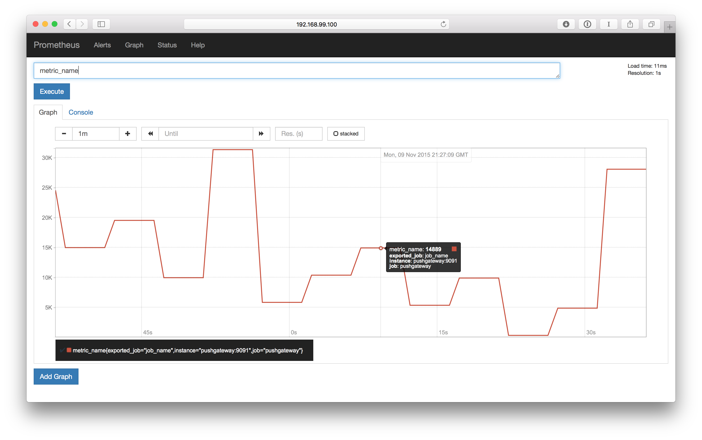

# prometheus-demo

A repository that uses `docker-compose` to bring up:

* [Prometheus][prometheus], for scraping metrics.
* [Pushgateway][prompush], to collect metrics (from the `push_data.sh` script.)
* [Grafana][grafana], as a UI.

## Getting Started

Install `docker-compose`, and then:

    $ docker-compose up
    $ ./push_data.sh

Then visit http://192.168.99.100:9090/graph, and run a query for 
"metric_name". Your IP will vary. You'll end up with a graph that might look
a little bit like this:

## TODO

* Grafana config "out of the box".
* Something to put more meaningful test data into the system.

[prometheus]: http://github.com/prometheus/prometheus
[prompush]: http://github.com/prometheus/pushgateway
[grafana]: http://github.com/grafana/grafana